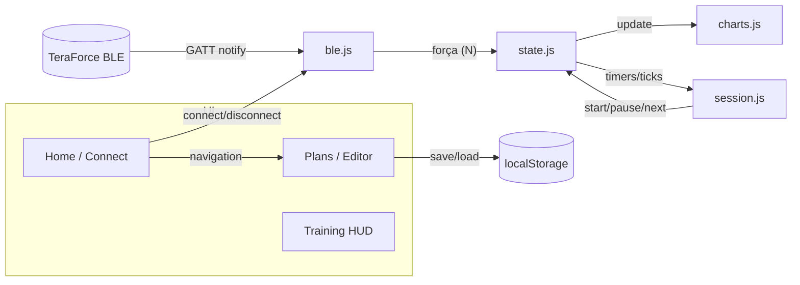

# IsoTrainer Web

[](#)
[](#)


## Table of Contents

- [Highlights](#highlights)
- [Quick Start](#quick-start)
- [Requirements](#requirements)
- [Project Structure](#project-structure)
- [Architecture](#architecture)
- [Core Workflows](#core-workflows)
- [CSV Session Format](#csv-session-format)
- [Testing](#testing)
- [Docker & Deploy](#docker--deploy)
- [Troubleshooting](#troubleshooting)
- [Contributing](#contributing)

---

## Highlights

- 🚀 Web Bluetooth força: conecta a dinamômetros TeraForce com streaming contínuo de dados.
- 📈 Live charts: Stage and full‑session plots with dynamic bounds and target bands.
- 🎯 Stage guidance: Clear in‑target indicators, halfway/next‑stage hints, and countdowns.
- 📥 Import/Export: Load training plans from CSV; import completed sessions; local history.
- 📱 PWA install: Add to home screen; automatic update prompts (network‑fresh SW).
- 🧭 No backend: Fully static; use locally or behind your own HTTPS reverse proxy.

---

## Quick Start

Choose one of the options below to run locally.

- Live server (simplest, recommended for dev)

- Docker (Nginx static image):
  ```bash
  docker build -t isotrainer-web .
  docker run --rm -p 8080:80 isotrainer-web
  # Visit http://localhost:8080
  ```

Notes
- Web Bluetooth requires HTTPS or `localhost`. Use a local server (as above) or HTTPS.
- Use Chrome/Edge on desktop or Chrome on Android. iOS support requires a WebBLE browser.

---

## Requirements

- Browser: Chrome 79+ or Edge 79+ with Bluetooth and permissions enabled.
- Dispositivo: dinamômetro TeraForce com firmware compatível (BLE). Suporte
  confirmado para as variantes que publicam o serviço Nordic UART
  (`6e400001-b5a3-f393-e0a9-e50e24dcca9e`) ou os serviços legados `0xffb0`
  / `0xffd0` com característica de notificação dedicada a força.
- HTTPS: Required for Web Bluetooth on production hosts. `localhost` is allowed in dev.

---

## Project Structure

```
.
├─ index.html               # Entry (Home / Connect / Plan)
├─ app.html                 # Full app layout / training flows
├─ styles.css               # Global styles (2‑space, single quotes)
├─ js/
│  ├─ main.js              # App bootstrap, routing, UI bindings
│  ├─ ble.js               # Web Bluetooth connect, força (N) via notificações
│  ├─ charts.js            # ECharts setup, scales, markers, stage/session series
│  ├─ session.js           # Session lifecycle, timers, UI updates, CSV import
│  ├─ plans.js             # Plans store (localStorage), history, migrations
│  ├─ edit-plan.js         # Plan editor logic and interactions
│  ├─ ui-fab.js            # Floating action menu (controls)
│  ├─ utils.js             # Time/format helpers
│  ├─ state.js             # Central shared state (device, charts, timers)
│  ├─ qr.js                # QR features (e.g., import via QR)
│  └─ pwa.js               # Install UI, update prompts, SW registration
├─ sw.js                    # Network‑fresh service worker (no caching)
├─ manifest.webmanifest     # PWA manifest
├─ icons/                   # App icons
├─ nginx.conf               # Strict static serving for Docker image
├─ Dockerfile               # Static Nginx container
└─ docker-compose.yml       # Example deploy (Traefik labels)
```

---

## Architecture

- Core runtime: Vanilla JS ES modules with a minimal shared `state` module.
- Live charts: ECharts canvas instances for stage and full session.
- Comms: Web Bluetooth GATT, serviço proprietário do TeraForce → característica de força com notificações.
- Persistence: LocalStorage for plans (`isotrainer:plans`) and done sessions
  (`isotrainer:doneSessions`). No server‑side storage.
- PWA: Installable; service worker enforces fresh network fetches and prompts on updates.



---

## Core Workflows

- Conectar um dispositivo
  1) Clique em Conectar → escolha o dinamômetro TeraForce (HTTPS ou localhost)
  2) O app localiza automaticamente o serviço compatível e se inscreve nos
     pacotes de força emitidos pelo equipamento
  3) A UI habilita os botões de planejamento/início e inicia a telemetria em N

- Iniciar uma sessão
  1) Importe o plano CSV (ou escolha um salvo)
  2) O pré-start mostra a força atual x alvo do primeiro estágio
  3) Pressione Play para iniciar a cronometragem; os gráficos exibem a força
     lida em tempo real
  4) As dicas de ajuste e o percentual dentro da zona são atualizados ao vivo

- Complete & save
  - Upon finishing, a summary is stored locally (`isotrainer:doneSessions`).
  - You can import exported CSVs back for review.

---

## CSV Session Format

- Header (semicolon separated): `ignored;ignored;date;athlete`
- Rows: `index;HH:MM:SS;lower;upper`

Example
```csv
Sessao;X;2024-09-30;Atleta X
1;00:05:00;120;140
2;00:06:00;130;150
3;00:04:30;140;160
```

Validation rules
- Each stage requires numeric `index`, `lower < upper`, and valid duration `HH:MM:SS`.
- The app derives `totalDurationSec` and computes in‑target metrics across the session.


## Testing

This is a hardware‑in‑the‑loop app; prioritize manual verification in Chrome/Edge.

- Critical paths
  - BLE connect/disconnect, streaming de força, reconexão em caso de queda
  - Session start/pause/resume/next/prev, countdown accuracy
  - Charts: bounds, markers, stage bands, responsiveness

- Fluxo sugerido
  1) Inicie um servidor local em `localhost`
  2) Pareie o TeraForce no SO (caso necessário)
  3) Conecte pelo app e confirme a leitura de força em tempo real
  4) Importe um plano de exemplo e execute uma sessão curta

---

## Docker & Deploy

- Local image
  ```bash
  docker build -t isotrainer-web .
  docker run --rm -p 8080:80 isotrainer-web
  ```

- Reverse proxy (Traefik example)
  - `docker-compose.yml` includes Traefik labels and `proxy` network.
  - Set your domain, TLS resolver, and ensure HTTPS termination for Web Bluetooth.

- Nginx config
  - Serves a strict allowlist of static files, denies dotfiles, and disables caching.
  - PWA endpoints (`/sw.js`, `/manifest.webmanifest`) are explicitly whitelisted.


---

## Troubleshooting

- “Web Bluetooth not available”
  - Use Chrome/Edge on desktop or Chrome on Android. Serve over HTTPS or `localhost`.
  - Ensure OS Bluetooth is on and the adapter is not in use by another app.

- Cannot find device
  - Some devices require OS‑level pairing first. Replace battery or wake the sensor.

- Sem dados após conectar
  - Verifique se o firmware do TeraForce expõe um dos serviços suportados
    (Nordic UART `6e400001` ou legados `0xffb0`/`0xffd0`) com notificações ativas.
  - Check site permissions: Page Info → Site settings → Allow Bluetooth.

- iOS support
  - Safari support is limited. Use a WebBLE‑enabled browser, or run on Android/desktop.

---

## Contributing

- Conventional Commits for clean history (e.g., `feat: add stage chart smoothing`).
- Keep PRs focused; include a short summary, screenshots for UI, and test notes.
- Follow the code style and module boundaries; prefer user‑visible status to console logs.

---
